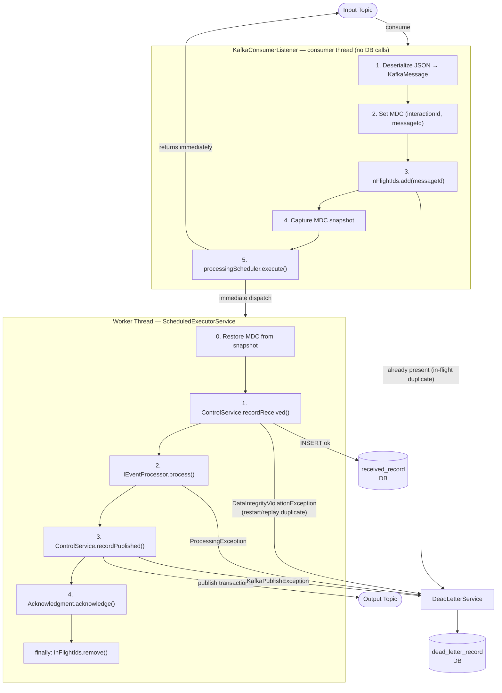
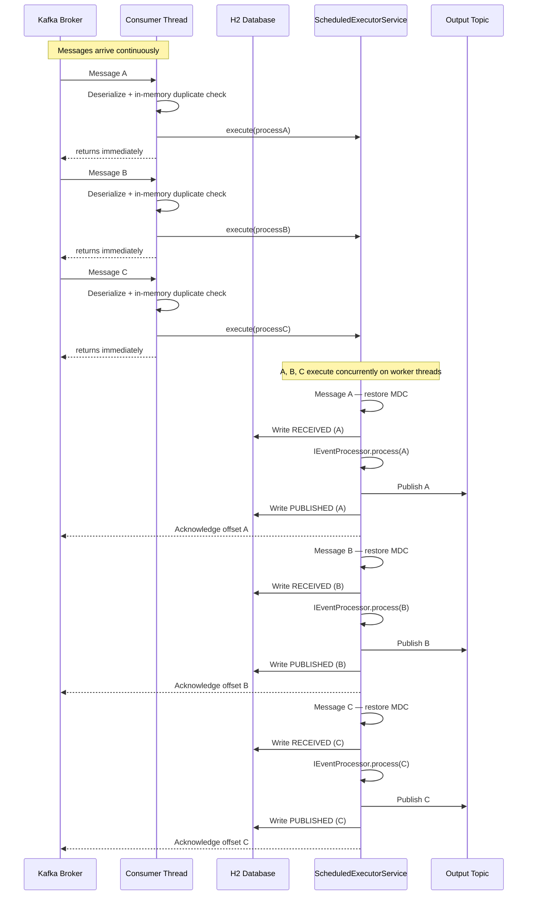

# Kafka Metrics Processor

A Spring Boot application that consumes messages from a Kafka input topic, persists IIF metrics to SCD2 tables, and publishes the enriched result to an output topic — with exactly-once semantics, atomic duplicate detection, Caffeine reference-data caching, and a REST API for operational visibility.

---

## Table of Contents

- [What It Does](#what-it-does)
- [Architecture](#architecture)
  - [Component Overview](#component-overview)
  - [Concurrency Flow](#concurrency-flow)
- [Event Processing](#event-processing)
- [Duplicate Detection](#duplicate-detection)
- [Dead Letter Reason Codes](#dead-letter-reason-codes)
- [REST API](#rest-api)
  - [GET /api/control/inbound](#get-apicontrolinbound)
  - [GET /api/control/outbound](#get-apicontroloutbound)
  - [GET /api/deadletter](#get-apideadletter)
  - [GET /api/config](#get-apiconfig)
- [Configuration](#configuration)
- [Project Structure](#project-structure)
- [Running Locally](#running-locally)
  - [1. Start the local stack](#1-start-the-local-stack)
  - [2. Build and run all tests](#2-build-and-run-all-tests)
  - [3. Run the application](#3-run-the-application)
  - [4. Generate test messages](#4-generate-test-messages)
  - [5. Send messages to Kafka](#5-send-messages-to-kafka)
  - [6. Monitor pipeline timings](#6-monitor-pipeline-timings)
  - [Full test loop](#full-test-loop)
- [Bruno API Collection](#bruno-api-collection)
- [IIF Metrics Persistence](#iif-metrics-persistence)
  - [SCD Type 2 — Effective Date Tracking](#scd-type-2--effective-date-tracking)
  - [Write Logic (saveFromNode)](#write-logic-savefromnode)
  - [Transaction Boundary](#transaction-boundary)
  - [Why the control table writes are separate transactions](#why-the-control-table-writes-are-separate-transactions)
- [Reference Data Services](#reference-data-services)
  - [Swapping the data source](#swapping-the-data-source)
- [Documentation](#documentation)

---

## What It Does

1. **Consumes** JSON messages from a Kafka input topic using `read_committed` isolation (EOS consumer).
2. **Deserializes** each message into a typed `KafkaMessage` envelope (`header` + `payload`).
3. **Deduplicates** atomically — uses an in-memory `ConcurrentHashMap` gate on the consumer thread; restart/replay duplicates are caught by a unique constraint on `ReceivedRecord.messageId` on the worker thread.
4. **Submits** the work immediately to a `ScheduledExecutorService` worker thread. The consumer thread returns and is free to pull the next message — no blocking.
5. **Processes** the message via the registered `IEventProcessor` implementation.
6. **Publishes** the enriched result to a Kafka output topic via a transactional producer.
7. **Acknowledges** the input offset only after the full pipeline succeeds.
8. Routes any failure to the **dead letter** store with a typed `reasonCode`.

---

## Architecture

### Component Overview



### Concurrency Flow



**Key points:**
- The **consumer thread makes zero DB calls** — fast operations only (deserialize, nanosecond in-memory duplicate check, submit), then returns immediately
- **All messages are in-flight simultaneously**, each executing on their own worker thread
- **Acknowledgment happens on the worker thread** after the full pipeline completes — Kafka does not advance the offset until then
- If the app restarts mid-flight, un-acked messages are redelivered; the unique constraint on `ReceivedRecord.message_id` catches restart/replay duplicates on the worker thread

---

## Event Processing

After the duplicate check, the pipeline delegates to the registered `IEventProcessor` implementation. The processor receives the `EventHeader` and `JsonNode` payload and is responsible for all business logic and the Kafka publish step.

Throwing any exception routes the message to dead letter:
- `ReasonCodeException` (and subclasses) — uses the typed `reasonCode` from the exception
- Any other exception — `PROCESSING_ERROR`

### How it works

`AbstractEventProcessor<T>` is a generic template-method base. `processInternal(header, payload, messageId)` returns the output object; the base class serializes it to JSON and publishes to `kafka.topic.output`. Subclasses only implement `processInternal`.

### Implemented processors

| Class | Behaviour |
|-------|-----------|
| `IifMetricsEventProcessor` | Extracts `agreementProductNbr`, calls `IifMetricsRawProcessorService.enrich()` to persist IIF metrics across three SCD2 tables, then publishes the enriched payload to `kafka.topic.output` |

### Adding a new processor

Extend `AbstractEventProcessor<T>`, annotate with `@Component`, and implement `processInternal`. The base class handles serialization and publish automatically. Only one `IEventProcessor` bean may be registered — `KafkaConsumerListener` injects a single implementation.

---

## Duplicate Detection

Duplicate detection uses two layers so the consumer thread never touches the database:

**Layer 1 — In-memory gate (consumer thread, nanosecond cost):**
- A `ConcurrentHashMap.newKeySet()` holds all `messageId`s currently in-flight.
- `add()` returns `false` if already present — the message is a duplicate within the 20-second delay window.
- Route to dead letter with `DUPLICATE` and ack immediately. No DB call, no round-trip.
- The set entry is removed in the worker's `finally` block (on success and on failure), so redelivered messages can re-enter the pipeline.

**Layer 2 — DB unique constraint (worker thread, restart/replay safety):**
- `ReceivedRecord` has a unique constraint on `message_id`.
- On app restart, the in-memory set is empty. When an un-acked message is redelivered, it passes Layer 1 but the DB constraint fires a `DataIntegrityViolationException` on the worker thread.
- Route to dead letter with `DUPLICATE` and ack.

**To replay a failed message:** delete its row from `received_record`, then replay the Kafka message. The INSERT will succeed and the message will process normally.

---

## Dead Letter Reason Codes

| Code | Trigger |
|------|---------|
| `INVALID_MESSAGE_ID` | `header.messageId` is missing or is not a valid UUID (`xxxxxxxx-xxxx-xxxx-xxxx-xxxxxxxxxxxx`) |
| `MISSING_PAYLOAD` | Message has no payload body |
| `DESERIALIZATION_ERROR` | Message payload is not valid JSON or does not match the expected schema |
| `LISTENING_ERROR` | Unexpected error on the consumer thread before dispatch |
| `DUPLICATE` | `messageId` already in the in-flight set (same-instance duplicate), or `DataIntegrityViolationException` from the DB unique constraint (restart/replay duplicate) |
| `CONTROL_RECORD_ERROR` | Unexpected failure writing the `ReceivedRecord` (not a constraint violation) |
| `PROCESSING_ERROR` | `IEventProcessor.process()` threw an unchecked exception, or processor timed out (`processor-timeout-ms`) |
| `PUBLISH_ERROR` | `KafkaProducerService.publish()` threw an exception |
| `DATABASE_ERROR` | An unexpected database error occurred during IIF metrics persistence |

---

## REST API

All endpoints return JSON. Timestamps are ISO-8601. `startTimestamp` defaults to **now minus 12 hours** when omitted; `endTimestamp` is optional and open-ended when omitted.

### `GET /api/control/inbound`
Returns `ReceivedRecord` entries — messages that entered the processing pipeline.

| Parameter | Default | Description |
|-----------|---------|-------------|
| `startTimestamp` | now − 12h | Filter: `receivedAt >=` |
| `endTimestamp` | none | Filter: `receivedAt <=` |

Response fields: `messageId`, `interactionId`, `receivedAt`

### `GET /api/control/outbound`
Returns `PublishedRecord` entries — messages successfully published to the output topic.

| Parameter | Default | Description |
|-----------|---------|-------------|
| `startTimestamp` | now − 12h | Filter: `publishedAt >=` |
| `endTimestamp` | none | Filter: `publishedAt <=` |

Response fields: `messageId`, `interactionId`, `publishedAt`

> A `messageId` that appears in inbound but not outbound within a reasonable time window indicates a processing failure worth investigating.

### `GET /api/deadletter`
Returns dead letter entries — messages that failed at any stage.

| Parameter | Default | Description |
|-----------|---------|-------------|
| `startTimestamp` | now − 12h | Filter: `failedAt >=` |
| `endTimestamp` | none | Filter: `failedAt <=` |

Response fields: `messageId`, `interactionId`, `reasonCode`, `rawPayload`, `failedAt`

### `GET /api/config`
Returns the current running configuration as JSON.

Response shape: `kafka` (bootstrapServers, consumerGroupId, consumerConcurrency, inputTopic, outputTopic) and `app` (processorTimeoutMs, workerThreads)

---

## Configuration

All settings are in `src/main/resources/application.yml`.

```yaml
app:
  processing:
    processor-timeout-ms: 10000   # hard timeout for processor step; 0 = disabled
    lookup-timeout-ms: 2000       # timeout for reference-data cache lookups
    status-log-interval-ms: 10000 # how often to log in-flight count; 0 = disabled
    worker-threads: 200           # scheduler core pool size (platform threads for dispatch only)
  seed-data:
    enabled: true                 # seed reference data on startup (H2 dev/test only)

spring:
  cache:
    cache-names: policyMaster,policyAor,producer,cfmPgPoints
    caffeine:
      spec: maximumSize=10000,expireAfterWrite=15m

kafka:
  bootstrap-servers: localhost:9092
  consumer:
    group-id: kafka-processor-group
    concurrency: 1            # threads per instance = partitions ÷ instances (10 ÷ 10 = 1)
  producer:
    transactional-id-prefix: kafkametrics-tx-${random.uuid}  # unique per instance restart
  topic:
    input: input-topic
    output: output-topic

server:
  port: 8080
```

**`worker-threads`:** controls how many platform threads the scheduler keeps alive to dispatch tasks. Actual task execution uses virtual threads (Java 21), so this has no effect on throughput or concurrency. A value of 4–8 is sufficient for most workloads.

**`lookup-timeout-ms`:** timeout applied to each Caffeine reference-data lookup (policy, producer, CFM pg points). A miss throws `RequiredFieldException` and routes the message to dead letter.

**`seed-data.enabled`:** when `true`, `IifDataSeeder` seeds all reference tables on startup (PolicyMaster, PolicyAor, Producer, CfmPgPoints). Safe for H2 dev/test only.

**Sizing `concurrency`:** set to `total partitions ÷ deployed instances`. With 10 partitions across 10 instances, `concurrency: 1` gives each instance exactly one partition. Setting it higher creates idle threads.

**`transactional-id-prefix`:** must be unique per deployed instance. Spring appends a monotonically increasing sequence number to form the full transactional ID. In multi-instance deployments, include an instance identifier in the prefix (e.g. `kafkametrics-tx-${INSTANCE_ID}`).

**Database:** the default config uses an H2 in-memory database which is wiped on every restart. For production, replace the `spring.datasource.*` and `spring.jpa.*` blocks with your target database (e.g. PostgreSQL, Oracle, SQL Server) and set `ddl-auto: validate` or `none`:

```yaml
spring:
  datasource:
    url: jdbc:postgresql://localhost:5432/kafkametrics
    username: kafkametrics
    password: secret
    driver-class-name: org.postgresql.Driver
  jpa:
    hibernate:
      ddl-auto: validate   # never use create-drop in production
    show-sql: false
```

---

## Project Structure

```
src/main/java/com/example/kafkametrics/
├── KafkaMetricsApplication.java
├── api/
│   ├── ConfigController.java            # GET /api/config — configuration view
│   ├── QueryController.java             # REST query endpoints
│   └── TimeRangeHelper.java             # default timestamp resolution
├── config/
│   └── AppProperties.java               # @ConfigurationProperties for app.*
├── control/
│   ├── IControlService.java             # interface
│   ├── ControlServiceImpl.java          # JPA implementation
│   ├── ControlStatus.java
│   ├── ReceivedRecord.java              # entity — unique constraint on messageId
│   ├── IReceivedRecordRepository.java
│   ├── PublishedRecord.java             # entity
│   └── IPublishedRecordRepository.java
├── deadletter/
│   ├── IDeadLetterService.java          # interface
│   ├── DeadLetterServiceImpl.java       # JPA implementation
│   ├── DeadLetterRecord.java            # entity
│   ├── IDeadLetterRepository.java
│   └── ReasonCode.java                  # enum
├── health/
├── kafka/
│   ├── KafkaConsumerConfig.java         # consumer + scheduler beans
│   ├── KafkaConsumerListener.java       # @KafkaListener — main pipeline
│   ├── KafkaProducerConfig.java         # transactional producer bean
│   ├── KafkaProducerService.java        # publish(key, payload, topic)
│   ├── KafkaPublishException.java
│   ├── KafkaTopicConfig.java
│   ├── DatabaseException.java
│   ├── ProcessingException.java
│   ├── ReasonCodeException.java
│   └── RequiredFieldException.java      # dead-letters on cache miss
├── logging/
│   └── MdcContext.java                  # MDC set/clear helpers
├── model/
│   ├── EventHeader.java                 # record — interactionId, messageId, etc.
│   ├── KafkaMessage.java                # record — header + payload envelope
│   └── OutboundEnvelope.java            # record — outbound header + output payload
├── processor/
│   ├── IEventProcessor.java             # interface — process(EventHeader, JsonNode)
│   ├── AbstractEventProcessor.java      # template: processInternal → serialize → publish
│   ├── MetricsEventProcessor.java       # abstract metrics base
│   └── metrics/
│       ├── MetricsEventProcessor.java   # concrete metrics processor base
│       ├── IifMetricsEventProcessor.java         # @Component — main registered processor
│       ├── IifMetricsRawProcessorService.java    # @Transactional — orchestrates all three IIF writes
│       ├── IifMetricsIncludedProcessorService.java
│       └── IifMetricsPgPointsProcessorService.java
├── repository/
│   ├── EffectiveDateConstants.java      # HIGH_DATE sentinel
│   ├── PolicyMaster.java                # entity — policy reference data
│   ├── IPolicyMasterRepository.java
│   ├── IPolicyMasterService.java        # interface — findByAgreementProductNumber
│   ├── PolicyMasterServiceImpl.java     # @Cacheable("policyMaster"), throws on miss
│   ├── PolicyAor.java                   # entity — agent of record
│   ├── IPolicyAorRepository.java
│   ├── IPolicyAorService.java           # interface — findByAgreementProductNumber
│   ├── PolicyAorServiceImpl.java        # @Cacheable("policyAor"), throws on miss
│   ├── Producer.java                    # entity — agencyNbr → bonusPrimaryAgencyNbr + cfmCd
│   ├── IProducerRepository.java
│   ├── IProducerService.java            # interface — findByAgencyNbr
│   ├── ProducerServiceImpl.java         # @Cacheable("producer"), throws on miss
│   ├── CfmPgPoints.java                 # entity — cfmCd + product combo → pgPointsValue
│   ├── ICfmPgPointsRepository.java
│   ├── IifDataSeeder.java               # seeds all reference tables on startup
│   ├── IifMetricsRaw.java               # SCD2 entity
│   ├── IIifMetricsRawRepository.java
│   ├── IIifMetricsRawRepositoryCustom.java
│   ├── IIifMetricsRawRepositoryCustomImpl.java   # SCD2 close + insert
│   ├── IifMetricInclusion.java          # SCD2 entity
│   ├── IIifMetricInclusionRepository.java
│   ├── IIifMetricInclusionRepositoryCustom.java
│   ├── IIifMetricInclusionRepositoryCustomImpl.java
│   ├── IifMetricsPgPoints.java          # SCD2 entity
│   ├── IIifMetricsPgPointsRepository.java
│   ├── IIifMetricsPgPointsRepositoryCustom.java
│   └── IIifMetricsPgPointsRepositoryCustomImpl.java
└── util/
    └── JsonNodes.java                   # safe JsonNode field accessors

src/test/java/com/example/kafkametrics/
├── api/
│   ├── ConfigControllerTest.java
│   └── QueryControllerTest.java
├── control/
│   └── ControlServiceImplTest.java
├── deadletter/
│   └── DeadLetterServiceImplTest.java
├── integration/
│   └── KafkaIntegrationTest.java        # @EmbeddedKafka full pipeline test
├── kafka/
│   └── KafkaConsumerListenerTest.java
└── processor/
```

---

## Running Locally

Requires Java 21 and Docker Desktop. All Gradle commands use `gradlew` (the wrapper) — no local Gradle installation needed.

### 1. Start the local stack

```bash
# First run or after changing KAFKA_CLUSTER_ID — clear stale volumes first:
docker compose down -v

# Start all services in the background:
docker compose up -d

# Open Grafana once the stack is up:
start http://localhost:3000
```

This starts four services:

| Service | URL | Credentials |
|---------|-----|-------------|
| Kafka broker (host) | `localhost:9092` | — |
| Kafka broker (internal) | `kafka:29092` | — (Docker container-to-container only) |
| Kafka UI | http://localhost:8081 | — |
| Prometheus | http://localhost:9090 | — |
| Grafana | http://localhost:3000 | admin / admin |

> **Kafka listener split:** Two advertised listeners are configured — `PLAINTEXT://localhost:9092` for the Spring Boot app running on the host, and `INTERNAL://kafka:29092` for services inside Docker (Kafka UI, etc.). Kafka tells connecting clients to reconnect on the advertised address, so a container given `localhost:9092` would try to connect to itself. Using the Docker service name `kafka:29092` resolves correctly within the Docker network.

**Kafka UI** (`http://localhost:8081`) — browse topics, consumer group lag, and individual messages.

**Prometheus** (`http://localhost:9090`) — raw metric store. Scrapes `/actuator/prometheus` on the running app every 5 seconds. Use the **Graph** tab to run ad-hoc PromQL queries.

**Grafana** (`http://localhost:3000`) — dashboards and alerting. Prometheus is auto-provisioned as the default datasource on first start — no manual setup needed.

#### Using Grafana

1. Open http://localhost:3000 and log in with `admin` / `admin`
2. Go to **Explore** (compass icon in the left sidebar) — the Prometheus datasource is pre-selected
3. Enter a PromQL query and click **Run query**

Useful queries:

```promql
# P95 end-to-end latency over the last minute (includes processing delay)
histogram_quantile(0.95, rate(kafka_processor_e2e_latency_seconds_bucket[1m]))

# P95 pipeline execution latency (code only, excludes delay)
histogram_quantile(0.95, rate(kafka_processor_pipeline_latency_seconds_bucket[1m]))

# Message throughput per second (published)
rate(kafka_processor_messages_published_total[1m])

# Dead letter rate by reason code
rate(kafka_processor_messages_failed_total[1m])

# Current in-flight estimate
kafka_processor_messages_received_total - kafka_processor_messages_published_total - kafka_processor_messages_failed_total
```

**CPU & Memory** (auto-collected by Micrometer — no code changes needed):

```promql
# JVM process CPU usage (0–1, multiply by 100 for %)
process_cpu_usage * 100

# System-wide CPU usage across all cores (0–1)
system_cpu_usage * 100

# JVM heap used vs max
jvm_memory_used_bytes{area="heap"}
jvm_memory_max_bytes{area="heap"}

# Heap utilization %
sum(jvm_memory_used_bytes{area="heap"}) / sum(jvm_memory_max_bytes{area="heap"}) * 100

# Non-heap (Metaspace, code cache, etc.)
jvm_memory_used_bytes{area="nonheap"}

# GC pause P95 latency
histogram_quantile(0.95, rate(jvm_gc_pause_seconds_bucket[1m]))

# GC pause rate (how often GC is running)
rate(jvm_gc_pause_seconds_count[1m])

# Live threads
jvm_threads_live_threads
jvm_threads_daemon_threads
```

To build a dashboard: **Dashboards → New → Add visualization**, paste a query, and save.

#### Stopping the stack

```bash
docker compose down        # stop containers, keep volumes
docker compose down -v     # stop containers AND delete all data
```

#### Resetting topics

Use this to clear messages from a topic between test runs without restarting the whole stack.

**Delete a topic** (auto-recreated on next produce/consume since `auto.create.topics.enable=true`):
```powershell
docker exec kafka /opt/kafka/bin/kafka-topics.sh --bootstrap-server localhost:9092 --delete --topic input-topic
docker exec kafka /opt/kafka/bin/kafka-topics.sh --bootstrap-server localhost:9092 --delete --topic output-topic
```

**Reset consumer group offset to beginning** (re-read all existing messages without deleting them — app must be stopped first):
```powershell
docker exec kafka /opt/kafka/bin/kafka-consumer-groups.sh `
  --bootstrap-server localhost:9092 `
  --group kafka-processor-group `
  --topic input-topic `
  --reset-offsets --to-earliest --execute
```

### 2. Build and run all tests

```bash
.\gradlew test
```

### 3. Run the application

Two independent profile axes control behaviour at startup:

| Axis | Profile | Effect |
|------|---------|--------|
| **Metrics** | `prometheus` *(default)* | `/actuator/prometheus` scraped by local Docker Prometheus |
| **Metrics** | `datadog` | Pushes metrics to Datadog every 10s — requires `DD_API_KEY` |
| **Logging** | `local` *(default)* | Human-readable log lines (`HH:mm:ss LEVEL logger interactionId messageId message`) |
| **Logging** | *(omit `local`)* | Structured JSON via logstash-logback-encoder — for CI / production |

**Local dev (readable logs + Prometheus — default):**
```powershell
.\gradlew bootRun
```

**Local dev with JSON logs (e.g. testing log aggregation):**
```powershell
.\gradlew bootRun --args='--spring.profiles.active=prometheus'
```

**Work (Datadog, JSON logs):**
```powershell
$env:DD_API_KEY = "your-api-key"
$env:SPRING_PROFILES_ACTIVE = "datadog"
.\gradlew bootRun
```
Or as a one-liner:
```bash
DD_API_KEY=your-api-key ./gradlew bootRun --args='--spring.profiles.active=datadog'
```

The `kafka.processor.*` counters and timers appear in Datadog automatically under those metric names. The `/actuator/prometheus` endpoint is only available under the `prometheus` profile.

### 4. Generate test messages

```powershell
# Default: 1000 messages with default distribution
.\gradlew generateMessages

# Custom count
.\gradlew generateMessages -Pcount=200

# Custom distribution (must sum to 100)
.\gradlew generateMessages -Pcount=500 -PpctNC=30 -PpctEND=45 -PpctTRM=5 -PpctRNW=20

# Custom BDE ratio within END events (default 20%)
.\gradlew generateMessages -Pcount=100 -PpctBDE=40
```

Output is written to `build/generated-messages/messages-<count>.jsonl` — one JSON object per line.

**Windows shortcut — `gen-messages.cmd`:**

```bat
gen-messages.cmd                         :: 1000 messages, default distribution
gen-messages.cmd 500                     :: 500 messages, default distribution
gen-messages.cmd 200 10 60 10 20 15      :: count pctNC pctEND pctTRM pctRNW pctBDE
```

### 5. Send messages to Kafka

```bat
send-messages.cmd                                          :: sends most recent JSONL → input-topic
send-messages.cmd build\generated-messages\messages-100.jsonl
send-messages.cmd build\generated-messages\messages-100.jsonl my-input-topic
```

Requires the `kafka` container to be running. The script copies the JSONL into the container and pipes it through `kafka-console-producer`.

### 6. Monitor pipeline timings

Open Grafana at **http://localhost:3000** → Dashboards → **Kafka Processor**.

The provisioned dashboard auto-loads and shows:
- **Throughput**: message rate and in-flight estimate
- **Latency**: E2E and pipeline P50 / P95 / P99
- **Dead letters**: rate by reason code
- **CPU & Memory**: process CPU %, JVM heap, threads, GC pause

### Full test loop

```powershell
# 1. Start the Docker stack (Kafka, Kafka UI, Prometheus, Grafana) — skip if already running
docker compose up -d

# 2. Start the application (new terminal)
.\gradlew bootRun

# 3. Generate test messages
gen-messages.cmd 100

# 4. Send them to Kafka
send-messages.cmd

# 5. Watch the pipeline process them in Grafana
start http://localhost:3000
```

While messages are processing, check the UIs:

| URL | What to look for |
|-----|-----------------|
| http://localhost:8081 | Kafka UI — consumer group lag draining on `input-topic`; messages appearing on `output-topic` |
| http://localhost:8080/actuator/health | App health — `processorThreadPool` utilization |
| http://localhost:3000 | Grafana — E2E and pipeline latency histograms (Explore tab) |

Arguments are positional and all optional — only the ones provided are passed to Gradle.

---

## Bruno API Collection

A [Bruno](https://www.usebruno.com/) collection is included in the `bruno/` folder, covering all REST endpoints and Actuator health/metrics checks.

**Open the collection:**
1. Install Bruno (free, open-source — [usebruno.com](https://www.usebruno.com/))
2. In Bruno: **Open Collection** → select the `bruno/` folder
3. Select the **local** environment (top-right dropdown) — sets `baseUrl` to `http://localhost:8080`

**Requests included:**

| Folder | Request | Endpoint |
|--------|---------|----------|
| api | Get Config | `GET /api/config` |
| api | Get Control Inbound | `GET /api/control/inbound` |
| api | Get Control Outbound | `GET /api/control/outbound` |
| api | Get Dead Letter | `GET /api/deadletter` |
| actuator | Health | `GET /actuator/health` |
| actuator | Health - Processor Thread Pool | `GET /actuator/health/processorThreadPool` |
| actuator | Metrics | `GET /actuator/metrics` |
| actuator | Metrics - E2E Latency | `GET /actuator/metrics/kafka.processor.e2e.latency` |
| actuator | Metrics - Pipeline Latency | `GET /actuator/metrics/kafka.processor.pipeline.latency` |
| actuator | Metrics - Messages Received | `GET /actuator/metrics/kafka.processor.messages.received` |
| actuator | Metrics - Messages Published | `GET /actuator/metrics/kafka.processor.messages.published` |
| actuator | Metrics - Messages Failed | `GET /actuator/metrics/kafka.processor.messages.failed` |
| actuator | Prometheus Scrape | `GET /actuator/prometheus` |
| actuator | Info | `GET /actuator/info` |

> Optional query parameters (`startTimestamp`, `endTimestamp`, `tag`) are pre-filled but **disabled** by default (prefixed with `~` in the `.bru` files). Enable them in Bruno's Params tab when needed.

---

## IIF Metrics Persistence

### SCD Type 2 — Effective Date Tracking

Both `iif_metrics_raw` and `iif_metric_inclusion` implement **Slowly Changing Dimension Type 2** history. Every time a record is written for a given `agreementProductNbr` + `assetId` key, the previous active row is closed and a new row is inserted.

| Column | Type | Meaning |
|--------|------|---------|
| `eff_begin_dt` | `Instant` | When this version became active |
| `eff_end_dt` | `Instant` | When this version was superseded; `HIGH_DATE` = still active |

**HIGH_DATE sentinel:** `Instant.ofEpochMilli(1231999900000L)` — defined once in `EffectiveDateConstants.HIGH_DATE` and used as the `eff_end_dt` for any currently active row.

To find the current active record for a key:
```sql
SELECT * FROM iif_metrics_raw
WHERE agreement_product_nbr = ?
  AND (asset_id = ? OR (asset_id IS NULL AND ? IS NULL))
  AND eff_end_dt = 1231999900000    -- HIGH_DATE epoch millis
```

### Write Logic (`saveFromNode`)

Both custom repository implementations (`IIifMetricsRawRepositoryCustomImpl`, `IIifMetricInclusionRepositoryCustomImpl`) follow the same two-step SCD2 write pattern:

1. **Close the previous active row** — JPQL bulk UPDATE sets `effEndDt = now` where `effEndDt = HIGH_DATE` and the key matches. Handles `null` `assetId` with an IS NULL guard:
   ```
   ((:assetId IS NULL AND r.assetId IS NULL) OR r.assetId = :assetId)
   ```

2. **Insert the new row** — `effBeginDt = now`, `effEndDt = HIGH_DATE`.

If no previous active row exists, the UPDATE is a no-op and the INSERT proceeds normally.

### Transaction Boundary

The close + insert pair is atomic. The transaction is opened by `IifMetricsEventProcessor` (annotated `@Transactional`) when `KafkaConsumerListener` calls `processor.process()`. All three processor services join this transaction via `REQUIRED` propagation:

```
IifMetricsEventProcessor.process() — @Transactional (outer transaction begins)
  └── IifMetricsRawProcessorService.enrich() — @Transactional(REQUIRED) joins
        └── iifMetricsRawRepository.saveFromNode(...)
              UPDATE iif_metrics_raw SET eff_end_dt = now        (close previous)
              INSERT INTO iif_metrics_raw                         (insert new)
  └── IifMetricsIncludedProcessorService.process() — @Transactional(REQUIRED) joins
        └── inclusionRepository.saveFromNode(...)
              UPDATE iif_metric_inclusion SET eff_end_dt = now  (close previous)
              INSERT INTO iif_metric_inclusion                   (insert new)
  └── IifMetricsPgPointsProcessorService.process() — @Transactional(REQUIRED) joins
        └── pgPointsRepository.saveFromNode(...)
              UPDATE iif_metric_pg_points SET eff_end_dt = now  (close previous)
              INSERT INTO iif_metric_pg_points                   (insert new)
  └── publisher.publish() — Kafka publish (inside TX boundary, before commit)
  commit (or rollback all six statements together)
```

If any of the six statements fails, all six roll back — no partial SCD2 state is ever committed. The Kafka publish also occurs inside the outer transaction boundary: if publish fails, all six DB writes roll back too.

The `CompletableFuture` lookups inside `enrich()` (`policyMasterService`, `policyAorService`) run on ForkJoinPool threads outside the transaction context — which is intentional, as they are read-only cache lookups that do not need transactional protection.

### Why the control table writes are separate transactions

`recordReceived()` and `recordPublished()` run in their own independent `@Transactional` calls and are intentionally **not** merged with the IIF write transaction:

**`recordReceived` is the duplicate guard.** It uses `saveAndFlush()` so the unique constraint on `message_id` fires and commits immediately. If it were merged into the IIF transaction and the IIF writes later failed, the `ReceivedRecord` would roll back — a redelivered message would then pass the duplicate gate a second time and be processed twice.

**The Kafka publish sits between the two control writes.** `recordPublished()` only runs after the Kafka publish succeeds. The publish is not a database operation and cannot be included in a DB transaction. Rolling the IIF writes back because a Kafka publish failed would leave the received record orphaned with no corresponding IIF data.

The full sequence with transaction boundaries is:

```
recordReceived()           — own @Transactional (commits; duplicate guard fires here)
  ↓
enrich() / @Transactional  — IIF writes (raw + inclusion + pg points)
  ↓
Kafka publish              — outside any transaction
  ↓
recordPublished()          — own @Transactional (only reached on successful publish)
  ↓
acknowledgment.acknowledge()
```

---

## Reference Data Services

Policy, AOR, and producer reference data is accessed through service interfaces rather than repositories directly:

| Interface | Impl | Cache |
|-----------|------|-------|
| `IPolicyMasterService` | `PolicyMasterServiceImpl` | `policyMaster` |
| `IPolicyAorService` | `PolicyAorServiceImpl` | `policyAor` |
| `IProducerService` | `ProducerServiceImpl` | `producer` |

Each implementation is `@Cacheable` via Caffeine (TTL 15 min, max 10 000 entries). A cache miss that returns no results throws `RequiredFieldException`, which routes the message to dead letter.

### Swapping the data source

The processor services (`IifMetricsRawProcessorService`, `IifMetricsPgPointsProcessorService`) depend only on the interfaces. To replace the database-backed implementations with API calls — or any other source — create a new implementation and qualify it:

```java
@Service
@Primary  // or @Profile("api")
public class PolicyMasterApiServiceImpl implements IPolicyMasterService {

    @Override
    @Cacheable("policyMaster")
    public PolicyMaster findByAgreementProductNumber(String agreementProductNumber) {
        // call upstream API here
    }
}
```

No changes to the processor services are required.

---

## Documentation

| File | Contents |
|------|----------|
| [requirements.md](requirements.md) | Full functional and non-functional requirements |
| [plan.md](plan.md) | Implementation phases and component breakdown |
| [tests.md](tests.md) | Description of every test and which requirement it covers |
| [concurrency-diagram.md](concurrency-diagram.md) | Mermaid sequence diagram of the scheduling model |
| [why.md](why.md) | Rationale for key architectural decisions |
