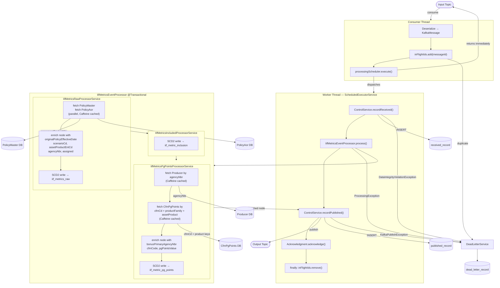
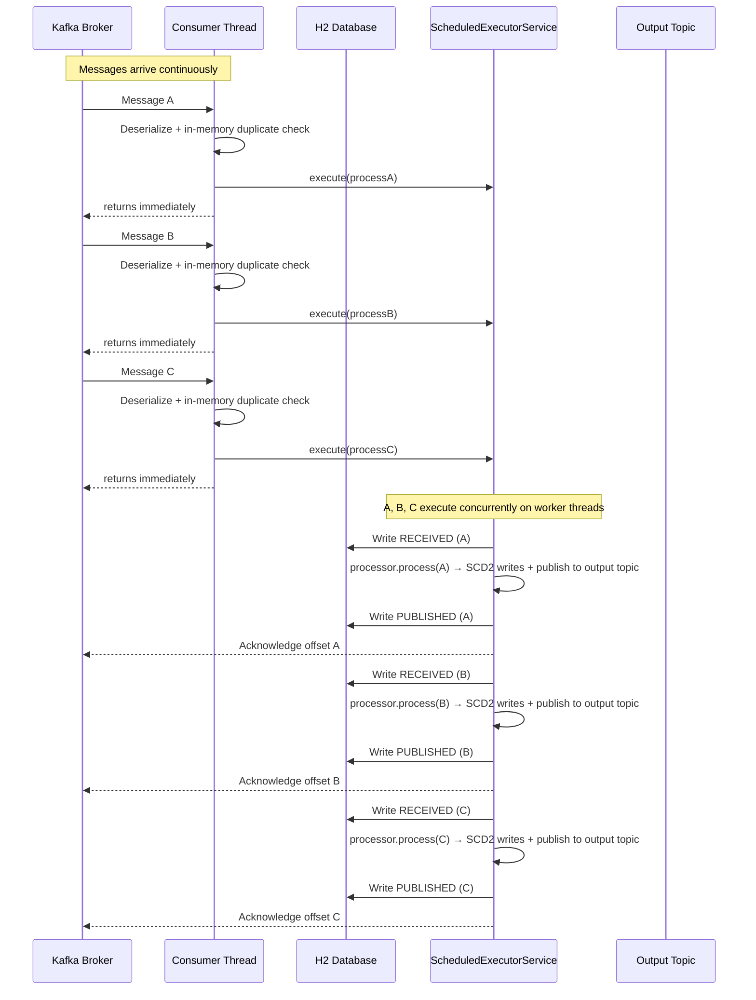

# Kafka Metrics Processor

A Spring Boot application that consumes messages from a Kafka input topic, persists IIF metrics to temporal (audit history) tables, and publishes the enriched result to an output topic — with exactly-once semantics, atomic duplicate detection, Caffeine reference-data caching, and a REST API for operational visibility.

---

## Table of Contents

- [What It Does](#what-it-does)
- [Architecture](#architecture)
  - [Component Overview](#component-overview)
  - [Concurrency Flow](#concurrency-flow)
- [Event Processing](#event-processing)
- [Duplicate Detection](#duplicate-detection)
- [Dead Letter Reason Codes](#dead-letter-reason-codes)
- [REST API](#rest-api)
  - [GET /api/control/inbound](#get-apicontrolinbound)
  - [GET /api/control/outbound](#get-apicontroloutbound)
  - [GET /api/deadletter](#get-apideadletter)
  - [GET /api/config](#get-apiconfig)
- [Configuration](#configuration)
- [Project Structure](#project-structure)
- [Running Locally](#running-locally)
  - [1. Start the local stack](#1-start-the-local-stack)
  - [2. Build and run all tests](#2-build-and-run-all-tests)
  - [3. Set up the database](#3-set-up-the-database)
    - [3a. One-time PostgreSQL setup](#3a-one-time-postgresql-setup-run-as-the-postgres-superuser)
    - [3b. Apply schema and seed data](#3b-apply-schema-and-seed-data)
  - [4. Run the application](#4-run-the-application)
  - [5. Generate test messages](#5-generate-test-messages)
  - [6. Send messages to Kafka](#6-send-messages-to-kafka)
  - [7. Monitor pipeline timings](#7-monitor-pipeline-timings)
  - [Full test loop](#full-test-loop)
- [Bruno API Collection](#bruno-api-collection)
- [IIF Metrics Persistence](#iif-metrics-persistence)
  - [Temporal Tables (aka Audit History Tables)](#temporal-tables-aka-audit-history-tables)
  - [Write Logic (saveFromNode)](#write-logic-savefromnode)
  - [Transaction Boundary](#transaction-boundary)
  - [Why the control table writes are separate transactions](#why-the-control-table-writes-are-separate-transactions)
- [Reference Data Services](#reference-data-services)
  - [Swapping the data source](#swapping-the-data-source)
- [Temporal Table Database Considerations](#temporal-table-database-considerations)
- [Message Walkthrough — Happy Path](#message-walkthrough--happy-path)
- [Documentation](#documentation)

---

## What It Does

1. **Consumes** JSON messages from a Kafka input topic using `read_committed` isolation (EOS consumer).
2. **Deserializes** each message into a typed `KafkaMessage` envelope (`header` + `payload`).
3. **Deduplicates** atomically — uses an in-memory `ConcurrentHashMap` gate on the consumer thread; restart/replay duplicates are caught by a unique constraint on `ReceivedRecord.messageId` on the worker thread.
4. **Submits** the work immediately to a `ScheduledExecutorService` worker thread. The consumer thread returns and is free to pull the next message — no blocking.
5. **Processes** the message via the registered `IEventProcessor` implementation.
6. **Publishes** the enriched result to a Kafka output topic via a transactional producer.
7. **Acknowledges** the input offset only after the full pipeline succeeds.
8. Routes any failure to the **dead letter** store with a typed `reasonCode`.

---

## Architecture

### Component Overview



### Concurrency Flow



**Key points:**
- The **consumer thread makes zero DB calls** — fast operations only (deserialize, nanosecond in-memory duplicate check, submit), then returns immediately
- **All messages are in-flight simultaneously**, each executing on their own worker thread
- **Acknowledgment happens on the worker thread** after the full pipeline completes — Kafka does not advance the offset until then
- If the app restarts mid-flight, un-acked messages are redelivered; the unique constraint on `ReceivedRecord.message_id` catches restart/replay duplicates on the worker thread

---

## Event Processing

After the duplicate check, the pipeline delegates to the registered `IEventProcessor` implementation. The processor receives the `EventHeader` and `JsonNode` payload and is responsible for all business logic and the Kafka publish step.

Throwing any exception routes the message to dead letter:
- `ReasonCodeException` (and subclasses) — uses the typed `reasonCode` from the exception
- Any other exception — `PROCESSING_ERROR`

### How it works

`AbstractEventProcessor<T>` is a generic template-method base. `processInternal(header, payload, messageId)` returns the output object; the base class serializes it to JSON and publishes to `kafka.topic.output`. Subclasses only implement `processInternal`.

### Implemented processors

| Class | Behaviour |
|-------|-----------|
| `IifMetricsEventProcessor` | Extracts `agreementProductNbr`, orchestrates calls to `IifMetricsRawProcessorService`, `IifMetricsIncludedProcessorService`, and `IifMetricsPgPointsProcessorService` to persist IIF metrics across three SCD2 tables, then publishes the enriched payload to `kafka.topic.output` |

### Adding a new processor module

The skeleton exposes a three-layer extension hierarchy:

```
IEventProcessor                        ← interface (skeleton)
  └── AbstractEventProcessor<T>        ← template-method base (skeleton)
        └── MetricsEventProcessor<T>   ← metrics-specific base (metrics-core)
              └── YourEventProcessor   ← your implementation (your module)
```

**Minimum contract — what your module must provide:**

| Requirement | Detail |
|-------------|--------|
| Extend `AbstractEventProcessor<T>` | (or `MetricsEventProcessor<T>` if metrics-specific) |
| Annotate with `@Service` | makes it a Spring bean; skeleton picks it up automatically |
| Implement `processInternal(header, payload, messageId)` | return the output object; skeleton handles serialization + publish |
| Depend on `:skeleton` (and `:metrics-core` if using `MetricsEventProcessor`) | no IIF or other metric-module dependency needed |

**Wiring:** `KafkaConsumerListener` declares `IEventProcessor processor` in its constructor. Spring injects the single implementation found on the classpath — no skeleton changes required.

**Multiple modules on the classpath:** annotate exactly one implementation with `@Primary`, or use `@Profile` to activate only one per environment.

**Exceptions:** throw `ReasonCodeException` (or a subclass) to route to dead letter with a typed reason code. Any other unchecked exception routes with `PROCESSING_ERROR`.

---

## Message Walkthrough — Happy Path

A trace of a single valid IIF message from Kafka arrival to committed offset.

### Step 1 — Consumer thread receives the message

`KafkaConsumerListener.listen()` is called by Spring Kafka with the raw `ConsumerRecord`.

1. **Deserialize & validate** — JSON is parsed, the `messageId` UUID and header/payload structure are checked. Any failure dead-letters immediately.
2. **Duplicate check** — `inFlightIds.add(messageId)` on a `ConcurrentHashSet`. If the same message is already being processed (two Kafka deliveries racing), `add()` returns `false` and it is dead-lettered as `DUPLICATE`. No DB call — nanosecond cost.
3. **Snapshot & submit** — MDC logging context is snapshotted, the e2e latency timer starts, and work is handed off:
   ```java
   processingScheduler.execute(() -> processDeferred(ctx, acknowledgment, e2eSample, mdcSnapshot))
   ```
   The consumer thread returns immediately and is free to poll the next message.

### Step 2 — Worker thread: record receipt

`processDeferred()` runs on a thread from the worker pool.

`controlService.recordReceived(messageId, interactionId)` inserts a row into `received_records` with a timestamp. This table has a **unique constraint on `messageId`** — so if the service restarted and Kafka redelivered this message, the insert throws `DataIntegrityViolationException`, which is caught, dead-lettered as `DUPLICATE`, and the offset is acknowledged. This is the second duplicate-detection layer, covering the crash/restart case that the in-memory set cannot catch.

### Step 3 — Worker thread: IIF processing (`processor.process()`)

`AbstractEventProcessor.process()` calls `IifMetricsEventProcessor.processInternal()`, which executes three services in sequence.

**3a. Raw Metrics** (`IifMetricsRawProcessorService`)

- Kicks off two async lookups in parallel: `PolicyMaster` and `PolicyAor` by `agreementProductNbr`, both Caffeine-cached
- Joins the futures, validates required fields (`originalPolicyEffectiveDate`, `scenarioCd`, `agencyNbr`, `assigned`)
- Enriches the JSON node with the looked-up values
- Writes to `iif_metrics_raw` using the temporal table close+insert pattern:
  - `UPDATE ... SET eff_end_dt = now WHERE eff_end_dt = HIGH_DATE` — closes the previous version
  - `INSERT` new row with `eff_begin_dt = now`, `eff_end_dt = HIGH_DATE`

**3b. Inclusion** (`IifMetricsIncludedProcessorService`)

This is where business exclusion rules are evaluated. The service inspects the enriched node to determine whether this product should be excluded from downstream IIF metric calculations. Any product that fails a business rule — wrong product family, missing eligibility indicator, out-of-scope scenario code, etc. — would have `excludedInd` set to `true` here. For a valid message that passes all rules, `excludedInd = false`.

The result is written to `iif_metric_inclusion` via the same close+insert temporal pattern. Like all three tables, this preserves a full audit history — every time the business rules are re-evaluated for a given product the outcome is recorded, making it straightforward to audit why a product dropped in or out of metrics over time.

**3c. PG Points** (`IifMetricsPgPointsProcessorService`)

This is where the business rules for PG point allocation are applied. The service resolves the agency's producer profile and the applicable point schedule, then calculates what PG points this product earns:

- Looks up `Producer` by `agencyNbr` → establishes the agency's `cfmCd` (their compensation framework) and `bonusPrimaryAgencyNbr` (the agency that receives bonus credit, which may differ from the writing agency)
- Looks up `CfmPgPoints` (load-all cache) using the four product classification keys (`agencyNbr`, `productFamilyEntCd`, `productSubFamilyEntCd`, `assetProductEntCd`) → retrieves the point value assigned to this product type under this agency's compensation framework
- Enriches the node with the resolved `pgPointsValue`, `cfmCode`, and `bonusPrimaryAgencyNbr`

Written to `iif_metrics_pg_points` via the same close+insert temporal pattern. The history table captures every recalculation, so the point value assigned to a product at any point in time — and under which compensation framework — is fully auditable.

`processInternal()` returns the enriched `JsonNode`.

### Step 4 — Worker thread: publish to output topic

Back in `AbstractEventProcessor.process()`:

- Wraps the enriched payload in an `OutboundEnvelope` (outbound header + enriched payload)
- `KafkaProducerService.publish()` uses a **transactional KafkaTemplate** and blocks on `.get()` waiting for the broker to confirm the send
- Published to `kafka.topic.output` with `messageId` as the record key

### Step 5 — Worker thread: record publish

`controlService.recordPublished(messageId, interactionId)` inserts into `published_records` with a timestamp. This is the audit trail that lets the REST API answer whether a given message has been published.

### Step 6 — Worker thread: acknowledge the offset

`acknowledgment.acknowledge()` commits the Kafka consumer group offset. This tells Kafka the message is fully processed and should not be redelivered. This only executes on the happy path — if any earlier step throws, this line is never reached, the offset stays uncommitted, and Kafka redelivers after the session timeout.

### Finally block — always runs

Regardless of success or failure:

- Pipeline and e2e latency timers are stopped and recorded
- `inFlightIds.remove(messageId)` — clears the in-memory duplicate guard so a redelivery is not incorrectly blocked
- MDC is cleared so the next message processed on this thread starts with a clean logging context

### Summary

```
Consumer thread:  receive → validate → duplicate? → snapshot MDC → submit to pool → return
Worker thread:    recordReceived → process (raw + inclusion + pgPoints + publish) → recordPublished → ack
Finally (always): timers → inFlightIds.remove → MDC.clear
```

---

## Duplicate Detection

Duplicate detection uses two layers so the consumer thread never touches the database:

**Layer 1 — In-memory gate (consumer thread, nanosecond cost):**
- A `ConcurrentHashMap.newKeySet()` holds all `messageId`s currently in-flight.
- `add()` returns `false` if already present — the message is a duplicate within the 20-second delay window.
- Route to dead letter with `DUPLICATE` and ack immediately. No DB call, no round-trip.
- The set entry is removed in the worker's `finally` block (on success and on failure), so redelivered messages can re-enter the pipeline.

**Layer 2 — DB unique constraint (worker thread, restart/replay safety):**
- `ReceivedRecord` has a unique constraint on `message_id`.
- On app restart, the in-memory set is empty. When an un-acked message is redelivered, it passes Layer 1 but the DB constraint fires a `DataIntegrityViolationException` on the worker thread.
- Route to dead letter with `DUPLICATE` and ack.

**To replay a failed message:** delete its row from `received_record`, then replay the Kafka message. The INSERT will succeed and the message will process normally.

---

## Dead Letter Reason Codes

| Code | Trigger |
|------|---------|
| `INVALID_MESSAGE_ID` | `header.messageId` is missing or is not a valid UUID (`xxxxxxxx-xxxx-xxxx-xxxx-xxxxxxxxxxxx`) |
| `MISSING_PAYLOAD` | Message has no payload body |
| `DESERIALIZATION_ERROR` | Message payload is not valid JSON or does not match the expected schema |
| `LISTENING_ERROR` | Unexpected error on the consumer thread before dispatch |
| `DUPLICATE` | `messageId` already in the in-flight set (same-instance duplicate), or `DataIntegrityViolationException` from the DB unique constraint (restart/replay duplicate) |
| `CONTROL_RECORD_ERROR` | Unexpected failure writing the `ReceivedRecord` (not a constraint violation) |
| `PROCESSING_ERROR` | `IEventProcessor.process()` threw an unchecked exception, or processor timed out (`processor-timeout-ms`) |
| `PUBLISH_ERROR` | `KafkaProducerService.publish()` threw an exception |
| `DATABASE_ERROR` | An unexpected database error occurred during IIF metrics persistence |

---

## REST API

All endpoints return JSON. Timestamps are ISO-8601. `startTimestamp` defaults to **now minus 12 hours** when omitted; `endTimestamp` is optional and open-ended when omitted.

### `GET /api/control/inbound`
Returns `ReceivedRecord` entries — messages that entered the processing pipeline.

| Parameter | Default | Description |
|-----------|---------|-------------|
| `startTimestamp` | now − 12h | Filter: `receivedAt >=` |
| `endTimestamp` | none | Filter: `receivedAt <=` |

Response fields: `messageId`, `interactionId`, `receivedAt`

### `GET /api/control/outbound`
Returns `PublishedRecord` entries — messages successfully published to the output topic.

| Parameter | Default | Description |
|-----------|---------|-------------|
| `startTimestamp` | now − 12h | Filter: `publishedAt >=` |
| `endTimestamp` | none | Filter: `publishedAt <=` |

Response fields: `messageId`, `interactionId`, `publishedAt`

> A `messageId` that appears in inbound but not outbound within a reasonable time window indicates a processing failure worth investigating.

### `GET /api/deadletter`
Returns dead letter entries — messages that failed at any stage.

| Parameter | Default | Description |
|-----------|---------|-------------|
| `startTimestamp` | now − 12h | Filter: `failedAt >=` |
| `endTimestamp` | none | Filter: `failedAt <=` |

Response fields: `messageId`, `interactionId`, `reasonCode`, `rawPayload`, `failedAt`

### `GET /api/config`
Returns the current running configuration as JSON.

Response shape: `kafka` (bootstrapServers, consumerGroupId, consumerConcurrency, inputTopic, outputTopic) and `app` (processorTimeoutMs, workerThreads)

---

## Configuration

All settings are in `src/main/resources/application.yml`.

```yaml
app:
  processing:
    processor-timeout-ms: 10000   # hard timeout for processor step; 0 = disabled
    lookup-timeout-ms: 2000       # timeout for reference-data cache lookups
    status-log-interval-ms: 10000 # how often to log in-flight count; 0 = disabled
    worker-threads: 200           # scheduler core pool size (platform threads for dispatch only)
  seed-data:
    enabled: true                 # seed reference data on startup (H2 dev/test only)

spring:
  cache:
    cache-names: policyMaster,policyAor,producer,cfmPgPoints
    caffeine:
      spec: maximumSize=10000,expireAfterWrite=15m

kafka:
  bootstrap-servers: localhost:9092
  consumer:
    group-id: kafka-processor-group
    concurrency: 1            # threads per instance = partitions ÷ instances (10 ÷ 10 = 1)
  producer:
    transactional-id-prefix: kafkametrics-tx-${random.uuid}  # unique per instance restart
  topic:
    input: input-topic
    output: output-topic

server:
  port: 8080
```

**`worker-threads`:** controls how many platform threads the scheduler keeps alive to dispatch tasks. Actual task execution uses virtual threads (Java 21), so this has no effect on throughput or concurrency. A value of 4–8 is sufficient for most workloads.

**`lookup-timeout-ms`:** timeout applied to each Caffeine reference-data lookup (policy, producer, CFM pg points). A miss throws `RequiredFieldException` and routes the message to dead letter.

**`seed-data.enabled`:** when `true`, `IifDataSeeder` seeds all reference tables on startup (PolicyMaster, PolicyAor, Producer, CfmPgPoints). Safe for H2 dev/test only.

**Sizing `concurrency`:** set to `total partitions ÷ deployed instances`. With 10 partitions across 10 instances, `concurrency: 1` gives each instance exactly one partition. Setting it higher creates idle threads.

**`transactional-id-prefix`:** must be unique per deployed instance. Spring appends a monotonically increasing sequence number to form the full transactional ID. In multi-instance deployments, include an instance identifier in the prefix (e.g. `kafkametrics-tx-${INSTANCE_ID}`).

**Database:** the default config uses an H2 in-memory database which is wiped on every restart. For production, replace the `spring.datasource.*` and `spring.jpa.*` blocks with your target database (e.g. PostgreSQL, Oracle, SQL Server) and set `ddl-auto: validate` or `none`:

```yaml
spring:
  datasource:
    url: jdbc:postgresql://localhost:5432/kafkametrics
    username: kafkametrics
    password: secret
    driver-class-name: org.postgresql.Driver
    hikari:
      maximum-pool-size: 20   # size independently of worker-threads — connections are held only
                              # during @Transactional SCD2 writes (milliseconds); 10-20 per instance
                              # is typical; 10 instances × 20 = 200 total Oracle connections
  jpa:
    hibernate:
      ddl-auto: validate   # never use create-drop in production
    show-sql: false
```

---

## Project Structure

The repository is a Gradle multi-module build. The **base module** (`kafkametricsbase`) is a reusable `java-library` skeleton with zero metric-specific knowledge. The **IIF module** (`kafkametricsiif`) is a runnable Spring Boot application that depends on the base and provides all metric-specific logic.

```
kafka.metrics/                            ← root (no source, build coordination only)
├── kafkametricsbase/                     ← skeleton library (java-library, no bootJar)
│   └── src/main/java/com/example/kafkametrics/
│       ├── api/
│       │   ├── ConfigController.java         # GET /api/config — configuration view
│       │   ├── QueryController.java          # REST query endpoints
│       │   └── TimeRangeHelper.java          # default timestamp resolution
│       ├── config/
│       │   └── AppProperties.java            # @ConfigurationProperties for app.*
│       ├── control/
│       │   ├── IControlService.java
│       │   ├── ControlServiceImpl.java       # JPA implementation
│       │   ├── ControlStatus.java
│       │   ├── ReceivedRecord.java           # entity — unique constraint on messageId
│       │   ├── IReceivedRecordRepository.java
│       │   ├── PublishedRecord.java          # entity
│       │   └── IPublishedRecordRepository.java
│       ├── deadletter/
│       │   ├── IDeadLetterService.java
│       │   ├── DeadLetterServiceImpl.java    # JPA implementation
│       │   ├── DeadLetterRecord.java         # entity
│       │   ├── IDeadLetterRepository.java
│       │   └── ReasonCode.java              # enum
│       ├── health/
│       │   └── ProcessorHealthIndicator.java
│       ├── kafka/
│       │   ├── KafkaConsumerConfig.java      # consumer + scheduler beans
│       │   ├── KafkaConsumerListener.java    # @KafkaListener — main pipeline
│       │   ├── KafkaProducerConfig.java      # transactional producer beans
│       │   ├── KafkaProducerService.java     # publish(key, payload, topic)
│       │   ├── KafkaTopicConfig.java
│       │   ├── DatabaseException.java
│       │   ├── KafkaPublishException.java
│       │   ├── ProcessingException.java
│       │   ├── ReasonCodeException.java
│       │   └── RequiredFieldException.java   # dead-letters on lookup miss
│       ├── logging/
│       │   └── MdcContext.java              # MDC set/clear helpers
│       ├── model/
│       │   ├── EventHeader.java             # record — messageId, interactionId, etc.
│       │   ├── KafkaMessage.java            # record — header + payload envelope
│       │   └── OutboundEnvelope.java        # record — outbound header + output payload
│       ├── services/processor/
│       │   ├── IEventProcessor.java         # interface — process(EventHeader, JsonNode)
│       │   ├── AbstractEventProcessor.java  # template: processInternal → serialize → publish
│       │   └── metrics/
│       │       └── MetricsEventProcessor.java   # abstract base for metrics processors
│       └── util/
│           └── JsonNodes.java               # safe JsonNode field accessors
│
└── kafkametricsiif/                      ← IIF runnable application (Spring Boot)
    └── src/main/java/com/example/kafkametrics/
        ├── KafkaMetricsApplication.java
        ├── repository/
        │   ├── lookup/                       # JPA entities + repos for reference data
        │   │   ├── PolicyMaster.java             # entity
        │   │   ├── IPolicyMasterRepository.java
        │   │   ├── PolicyAor.java                # entity — agent of record
        │   │   ├── IPolicyAorRepository.java
        │   │   ├── Producer.java                 # entity — agencyNbr → cfmCd
        │   │   ├── IProducerRepository.java
        │   │   ├── CfmPgPoints.java              # entity — cfmCd + product → pgPointsValue
        │   │   ├── ICfmPgPointsRepository.java
        │   │   └── IifDataSeeder.java            # seeds reference tables on startup
        │   └── metrics/
        │       ├── EffectiveDateConstants.java   # HIGH_DATE SCD2 sentinel
        │       └── iif/                          # SCD2 IIF persistence
        │           ├── IifMetricsRaw.java + repo + customImpl
        │           ├── IifMetricInclusion.java   + repo + customImpl
        │           └── IifMetricsPgPoints.java   + repo + customImpl
        └── services/
            ├── metrics/lookup/               # cached reference-data service layer
            │   ├── IPolicyMasterService.java / PolicyMasterServiceImpl.java   # @Cacheable
            │   ├── IPolicyAorService.java    / PolicyAorServiceImpl.java      # @Cacheable
            │   └── IProducerService.java     / ProducerServiceImpl.java       # @Cacheable
            └── processor/metrics/iif/        # IIF-specific processing
                ├── IifMetricsEventProcessor.java          # @Service @Transactional — orchestrator
                ├── IifMetricsRawProcessorService.java     # enriches + writes iif_metrics_raw
                ├── IifMetricsIncludedProcessorService.java
                └── IifMetricsPgPointsProcessorService.java
```

### Tests

```
kafkametricsbase/src/test/
├── api/ConfigControllerTest.java, QueryControllerTest.java
├── control/ControlServiceImplTest.java
├── deadletter/DeadLetterServiceImplTest.java
└── kafka/KafkaConsumerListenerTest.java

kafkametricsiif/src/test/
└── integration/KafkaIntegrationTest.java    # @EmbeddedKafka full pipeline test
```

---

## Running Locally

Requires Java 21 and Docker Desktop. All Gradle commands use `gradlew` (the wrapper) — no local Gradle installation needed.

### 1. Start the local stack

```bash
# First run or after changing KAFKA_CLUSTER_ID — clear stale volumes first:
docker compose down -v

# Start all services in the background:
docker compose up -d

# Open Grafana once the stack is up:
start http://localhost:3000
```

This starts four services:

| Service | URL | Credentials |
|---------|-----|-------------|
| Kafka broker (host) | `localhost:9092` | — |
| Kafka broker (internal) | `kafka:29092` | — (Docker container-to-container only) |
| Kafka UI | http://localhost:8081 | — |
| Prometheus | http://localhost:9090 | — |
| Grafana | http://localhost:3000 | admin / admin |

> **Kafka listener split:** Two advertised listeners are configured — `PLAINTEXT://localhost:9092` for the Spring Boot app running on the host, and `INTERNAL://kafka:29092` for services inside Docker (Kafka UI, etc.). Kafka tells connecting clients to reconnect on the advertised address, so a container given `localhost:9092` would try to connect to itself. Using the Docker service name `kafka:29092` resolves correctly within the Docker network.

**Kafka UI** (`http://localhost:8081`) — browse topics, consumer group lag, and individual messages.

**Prometheus** (`http://localhost:9090`) — raw metric store. Scrapes `/actuator/prometheus` on the running app every 5 seconds. Use the **Graph** tab to run ad-hoc PromQL queries.

**Grafana** (`http://localhost:3000`) — dashboards and alerting. Prometheus is auto-provisioned as the default datasource on first start — no manual setup needed.

#### Using Grafana

1. Open http://localhost:3000 and log in with `admin` / `admin`
2. Go to **Explore** (compass icon in the left sidebar) — the Prometheus datasource is pre-selected
3. Enter a PromQL query and click **Run query**

Useful queries:

```promql
# P95 end-to-end latency over the last minute (includes processing delay)
histogram_quantile(0.95, rate(kafka_processor_e2e_latency_seconds_bucket[1m]))

# P95 pipeline execution latency (code only, excludes delay)
histogram_quantile(0.95, rate(kafka_processor_pipeline_latency_seconds_bucket[1m]))

# Message throughput per second (published)
rate(kafka_processor_messages_published_total[1m])

# Dead letter rate by reason code
rate(kafka_processor_messages_failed_total[1m])

# Current in-flight estimate
kafka_processor_messages_received_total - kafka_processor_messages_published_total - kafka_processor_messages_failed_total
```

**CPU & Memory** (auto-collected by Micrometer — no code changes needed):

```promql
# JVM process CPU usage (0–1, multiply by 100 for %)
process_cpu_usage * 100

# System-wide CPU usage across all cores (0–1)
system_cpu_usage * 100

# JVM heap used vs max
jvm_memory_used_bytes{area="heap"}
jvm_memory_max_bytes{area="heap"}

# Heap utilization %
sum(jvm_memory_used_bytes{area="heap"}) / sum(jvm_memory_max_bytes{area="heap"}) * 100

# Non-heap (Metaspace, code cache, etc.)
jvm_memory_used_bytes{area="nonheap"}

# GC pause P95 latency
histogram_quantile(0.95, rate(jvm_gc_pause_seconds_bucket[1m]))

# GC pause rate (how often GC is running)
rate(jvm_gc_pause_seconds_count[1m])

# Live threads
jvm_threads_live_threads
jvm_threads_daemon_threads
```

To build a dashboard: **Dashboards → New → Add visualization**, paste a query, and save.

#### Stopping the stack

```bash
docker compose down        # stop containers, keep volumes
docker compose down -v     # stop containers AND delete all data
```

#### Resetting topics

Use this to clear messages from a topic between test runs without restarting the whole stack.

**Delete a topic** (auto-recreated on next produce/consume since `auto.create.topics.enable=true`):
```powershell
docker exec kafka /opt/kafka/bin/kafka-topics.sh --bootstrap-server localhost:9092 --delete --topic input-topic
docker exec kafka /opt/kafka/bin/kafka-topics.sh --bootstrap-server localhost:9092 --delete --topic output-topic
```

**Reset consumer group offset to beginning** (re-read all existing messages without deleting them — app must be stopped first):
```powershell
docker exec kafka /opt/kafka/bin/kafka-consumer-groups.sh `
  --bootstrap-server localhost:9092 `
  --group kafka-processor-group `
  --topic input-topic `
  --reset-offsets --to-earliest --execute
```

### 2. Build and run all tests

```bash
.\gradlew test
```

### 3. Set up the database

The application uses **PostgreSQL** (`localhost:5432`, database `metrics`). Schema is managed by Flyway and reference data by a seeder task — both run independently of the application.

#### 3a. One-time PostgreSQL setup (run as the `postgres` superuser)

Before running Flyway, the database, schema, and roles must exist. Connect to PostgreSQL as `postgres` (e.g. via the **SQL Shell (psql)** app in the PostgreSQL Start Menu folder) and run:

```sql
-- Create the database
CREATE DATABASE metrics;

\c metrics

-- Create the dedicated application schema owned by the admin role
CREATE SCHEMA IF NOT EXISTS iif;

-- Create roles
CREATE ROLE metrics_admin WITH LOGIN PASSWORD 'metrics_admin';
CREATE ROLE metrics WITH LOGIN PASSWORD 'metrics';

-- Grant the admin role full rights on the database and schema
GRANT ALL PRIVILEGES ON DATABASE metrics TO metrics_admin;
GRANT CREATE ON DATABASE metrics TO metrics_admin;
ALTER SCHEMA iif OWNER TO metrics_admin;

-- Grant the app role usage on the schema (read/write, no DDL)
GRANT USAGE ON SCHEMA iif TO metrics;
GRANT SELECT, INSERT, UPDATE, DELETE ON ALL TABLES IN SCHEMA iif TO metrics;
ALTER DEFAULT PRIVILEGES IN SCHEMA iif
    GRANT SELECT, INSERT, UPDATE, DELETE ON TABLES TO metrics;
```

> **Note:** PostgreSQL 15+ no longer grants `CREATE` on the `public` schema to all users by default. The `iif` schema sidesteps this — `metrics_admin` owns it and has full DDL rights; `metrics` has DML-only access.

#### 3b. Apply schema and seed data

**Apply schema migrations (run once, or after any new migration file):**
```powershell
.\gradlew :kafkametricsiif:flywayMigrate
```

**Check migration status:**
```powershell
.\gradlew :kafkametricsiif:flywayInfo
```

**Validate applied migrations match local SQL files:**
```powershell
.\gradlew :kafkametricsiif:flywayValidate
```

**Seed reference data (PolicyMaster, PolicyAor, Producer, CfmPgPoints):**
```powershell
.\gradlew :kafkametricsiif:seedDatabase
```

> The seeder is idempotent — if data already exists it logs a skip message and exits. To re-seed from scratch, truncate the lookup tables first: `TRUNCATE policy_master CASCADE;` then re-run `seedDatabase`.

**Typical first-time setup sequence:**
```powershell
.\gradlew :kafkametricsiif:flywayMigrate
.\gradlew :kafkametricsiif:seedDatabase
```

### 4. Run the application


Two independent profile axes control behaviour at startup:

| Axis | Profile | Effect |
|------|---------|--------|
| **Metrics** | `prometheus` *(default)* | `/actuator/prometheus` scraped by local Docker Prometheus |
| **Metrics** | `datadog` | Pushes metrics to Datadog every 10s — requires `DD_API_KEY` |
| **Logging** | `local` *(default)* | Human-readable log lines (`HH:mm:ss LEVEL logger interactionId messageId message`) |
| **Logging** | *(omit `local`)* | Structured JSON via logstash-logback-encoder — for CI / production |

**Local dev (readable logs + Prometheus — default):**
```powershell
.\gradlew :kafkametricsiif:bootRun
```

**Local dev with JSON logs (e.g. testing log aggregation):**
```powershell
.\gradlew :kafkametricsiif:bootRun --args='--spring.profiles.active=prometheus'
```

**Work (Datadog, JSON logs):**
```powershell
$env:DD_API_KEY = "your-api-key"
$env:SPRING_PROFILES_ACTIVE = "datadog"
.\gradlew :kafkametricsiif:bootRun
```
Or as a one-liner:
```bash
DD_API_KEY=your-api-key ./gradlew :kafkametricsiif:bootRun --args='--spring.profiles.active=datadog'
```

The `kafka.processor.*` counters and timers appear in Datadog automatically under those metric names. The `/actuator/prometheus` endpoint is only available under the `prometheus` profile.

### 5. Generate test messages

```powershell
# Default: 1000 messages
.\gradlew generateMessages

# Custom count
.\gradlew generateMessages -Pcount=200
```

Messages reference the agreement product numbers and product combos seeded by `IifDataSeeder` (deterministic `Random(42)`), so every generated message will process cleanly without dead-lettering.

Output is written to `build/generated-messages/messages-<count>.jsonl` — one JSON object per line.

**Windows shortcut — `gen-messages.cmd`:**

```bat
gen-messages.cmd          :: 1000 messages
gen-messages.cmd 500      :: 500 messages
```

### 6. Send messages to Kafka

```bat
send-messages.cmd                                          :: sends most recent JSONL → input-topic
send-messages.cmd build\generated-messages\messages-100.jsonl
send-messages.cmd build\generated-messages\messages-100.jsonl my-input-topic
```

Requires the `kafka` container to be running. The script copies the JSONL into the container and pipes it through `kafka-console-producer`.

### 7. Monitor pipeline timings

Open Grafana at **http://localhost:3000** → Dashboards → **Kafka Processor**.

The provisioned dashboard auto-loads and shows:
- **Throughput**: message rate and in-flight estimate
- **Latency**: E2E and pipeline P50 / P95 / P99
- **Dead letters**: rate by reason code
- **CPU & Memory**: process CPU %, JVM heap, threads, GC pause

### Full test loop

```powershell
# 1. Start the Docker stack (Kafka, Kafka UI, Prometheus, Grafana) — skip if already running
docker compose up -d

# 2. Start the application (new terminal)
.\gradlew :kafkametricsiif:bootRun

# 3. Generate test messages
gen-messages.cmd 100

# 4. Send them to Kafka
send-messages.cmd

# 5. Watch the pipeline process them in Grafana
start http://localhost:3000
```

While messages are processing, check the UIs:

| URL | What to look for |
|-----|-----------------|
| http://localhost:8081 | Kafka UI — consumer group lag draining on `input-topic`; messages appearing on `output-topic` |
| http://localhost:8080/actuator/health | App health — `processorThreadPool` utilization |
| http://localhost:3000 | Grafana — E2E and pipeline latency histograms (Explore tab) |

Arguments are positional and all optional — only the ones provided are passed to Gradle.

---

## Bruno API Collection

A [Bruno](https://www.usebruno.com/) collection is included in the `bruno/` folder, covering all REST endpoints and Actuator health/metrics checks.

**Open the collection:**
1. Install Bruno (free, open-source — [usebruno.com](https://www.usebruno.com/))
2. In Bruno: **Open Collection** → select the `bruno/` folder
3. Select the **local** environment (top-right dropdown) — sets `baseUrl` to `http://localhost:8080`

**Requests included:**

| Folder | Request | Endpoint |
|--------|---------|----------|
| api | Get Config | `GET /api/config` |
| api | Get Control Inbound | `GET /api/control/inbound` |
| api | Get Control Outbound | `GET /api/control/outbound` |
| api | Get Dead Letter | `GET /api/deadletter` |
| actuator | Health | `GET /actuator/health` |
| actuator | Health - Processor Thread Pool | `GET /actuator/health/processorThreadPool` |
| actuator | Metrics | `GET /actuator/metrics` |
| actuator | Metrics - E2E Latency | `GET /actuator/metrics/kafka.processor.e2e.latency` |
| actuator | Metrics - Pipeline Latency | `GET /actuator/metrics/kafka.processor.pipeline.latency` |
| actuator | Metrics - Messages Received | `GET /actuator/metrics/kafka.processor.messages.received` |
| actuator | Metrics - Messages Published | `GET /actuator/metrics/kafka.processor.messages.published` |
| actuator | Metrics - Messages Failed | `GET /actuator/metrics/kafka.processor.messages.failed` |
| actuator | Prometheus Scrape | `GET /actuator/prometheus` |
| actuator | Info | `GET /actuator/info` |

> Optional query parameters (`startTimestamp`, `endTimestamp`, `tag`) are pre-filled but **disabled** by default (prefixed with `~` in the `.bru` files). Enable them in Bruno's Params tab when needed.

---

## IIF Metrics Persistence

### Temporal Tables (aka Audit History Tables)

The IIF metrics tables use a **temporal table** pattern (also called audit history tables): instead of overwriting a row when data changes, you keep the old row and insert a new one, so you never lose history.

Concretely: instead of updating a row in place, you:

1. **Close** the previous row by setting `eff_end_dt = now`
2. **Insert** a new row with `eff_begin_dt = now` and `eff_end_dt = HIGH_DATE` (a far-future sentinel meaning "still active")

At any point in time you can query what the data *was*, not just what it *is now*.

> This pattern is sometimes called **SCD Type 2** (Slowly Changing Dimension Type 2) — a data warehousing term that stuck even when applied outside DW contexts. The SQL:2011 standard codified it as **system-versioned temporal tables** (`PERIOD FOR SYSTEM_TIME`), supported natively by Oracle 12c (via Flashback Data Archive), SQL Server, MariaDB, and DB2. This codebase implements it manually since H2 and most JPA stacks don't support the native syntax out of the box.

| Column | Type | Meaning |
|--------|------|---------|
| `eff_begin_dt` | `Instant` | When this version became active |
| `eff_end_dt` | `Instant` | When this version was superseded; `HIGH_DATE` = still active |

**HIGH_DATE sentinel:** `Instant.ofEpochMilli(1231999900000L)` — defined once in `EffectiveDateConstants.HIGH_DATE` and used as the `eff_end_dt` for any currently active row.

To find the current active record for a key:
```sql
SELECT * FROM iif_metrics_raw
WHERE agreement_product_nbr = ?
  AND (asset_id = ? OR (asset_id IS NULL AND ? IS NULL))
  AND eff_end_dt = 1231999900000    -- HIGH_DATE epoch millis
```

### Write Logic (`saveFromNode`)

Both custom repository implementations (`IIifMetricsRawRepositoryCustomImpl`, `IIifMetricInclusionRepositoryCustomImpl`) follow the same two-step SCD2 write pattern:

1. **Close the previous active row** — JPQL bulk UPDATE sets `effEndDt = now` where `effEndDt = HIGH_DATE` and the key matches. Handles `null` `assetId` with an IS NULL guard:
   ```
   ((:assetId IS NULL AND r.assetId IS NULL) OR r.assetId = :assetId)
   ```

2. **Insert the new row** — `effBeginDt = now`, `effEndDt = HIGH_DATE`.

If no previous active row exists, the UPDATE is a no-op and the INSERT proceeds normally.

### Transaction Boundary

The close + insert pair is atomic. The transaction is opened by `IifMetricsEventProcessor` (annotated `@Transactional`) when `KafkaConsumerListener` calls `processor.process()`. All three processor services join this transaction via `REQUIRED` propagation:

```
IifMetricsEventProcessor.process() — @Transactional (outer transaction begins)
  └── IifMetricsRawProcessorService.process() — @Transactional(REQUIRED) joins
        └── iifMetricsRawRepository.saveFromNode(...)
              UPDATE iif_metrics_raw SET eff_end_dt = now        (close previous)
              INSERT INTO iif_metrics_raw                         (insert new)
  └── IifMetricsIncludedProcessorService.process() — @Transactional(REQUIRED) joins
        └── inclusionRepository.saveFromNode(...)
              UPDATE iif_metric_inclusion SET eff_end_dt = now  (close previous)
              INSERT INTO iif_metric_inclusion                   (insert new)
  └── IifMetricsPgPointsProcessorService.process() — @Transactional(REQUIRED) joins
        └── pgPointsRepository.saveFromNode(...)
              UPDATE iif_metric_pg_points SET eff_end_dt = now  (close previous)
              INSERT INTO iif_metric_pg_points                   (insert new)
  └── publisher.publish() — Kafka publish (inside TX boundary, before commit)
  commit (or rollback all six statements together)
```

If any of the six statements fails, all six roll back — no partial SCD2 state is ever committed. The Kafka publish also occurs inside the outer transaction boundary: if publish fails, all six DB writes roll back too.

The `CompletableFuture` lookups inside `IifMetricsRawProcessorService.process()` (`policyMasterService`, `policyAorService`) run on ForkJoinPool threads outside the transaction context — which is intentional, as they are read-only cache lookups that do not need transactional protection.

### Why the control table writes are separate transactions

`recordReceived()` and `recordPublished()` run in their own independent `@Transactional` calls and are intentionally **not** merged with the IIF write transaction:

**`recordReceived` is the duplicate guard.** It uses `saveAndFlush()` so the unique constraint on `message_id` fires and commits immediately. If it were merged into the IIF transaction and the IIF writes later failed, the `ReceivedRecord` would roll back — a redelivered message would then pass the duplicate gate a second time and be processed twice.

**The Kafka publish sits between the two control writes.** `recordPublished()` only runs after the Kafka publish succeeds. The publish is not a database operation and cannot be included in a DB transaction. Rolling the IIF writes back because a Kafka publish failed would leave the received record orphaned with no corresponding IIF data.

The full sequence with transaction boundaries is:

```
recordReceived()           — own @Transactional (commits; duplicate guard fires here)
  ↓
IifMetricsEventProcessor.process() / @Transactional  — IIF writes (raw + inclusion + pg points)
  ↓
Kafka publish              — outside any transaction
  ↓
recordPublished()          — own @Transactional (only reached on successful publish)
  ↓
acknowledgment.acknowledge()
```

---

## Reference Data Services

Policy, AOR, and producer reference data is accessed through service interfaces rather than repositories directly:

| Interface | Impl | Cache strategy |
|-----------|------|-------|
| `IPolicyMasterService` | `PolicyMasterServiceImpl` | Per-key Caffeine — `@Cacheable`, TTL 15 min, max 10 000 entries |
| `IPolicyAorService` | `PolicyAorServiceImpl` | Per-key Caffeine — `@Cacheable`, TTL 15 min, max 10 000 entries |
| `IProducerService` | `ProducerServiceImpl` | Per-key Caffeine — `@Cacheable`, TTL 15 min, max 10 000 entries |
| `ICfmPgPointsService` | `CfmPgPointsServiceImpl` | Load-all — full table loaded at startup, refreshed on schedule |
| `IExclusionRuleService` | `ExclusionRuleServiceImpl` | Load-all — full table loaded at startup, refreshed on schedule (**stub** — always returns `false` until `exclusion_rules` entity/repository is built) |

A cache miss that returns no results throws `RequiredFieldException`, which routes the message to dead letter.

### Per-key vs load-all caching

**Per-key Caffeine** (`PolicyMaster`, `PolicyAor`, `Producer`) is used when the table is large and each message only needs one specific row. The cache is populated on first access and entries expire individually after 15 minutes.

**Load-all** (`CfmPgPoints`, exclusion rules) is used when the table is a complete ruleset — every row is relevant to the application and the whole table fits comfortably in memory. The full table is loaded in a single query at startup, then swapped atomically on a schedule. No individual per-key DB calls ever occur during message processing.

The load-all pattern avoids the *thundering herd* problem that per-key TTL produces on a complete ruleset: with ~600 CFMs × 15 products = ~9 000 `CfmPgPoints` rows, per-key expiry would trigger up to 9 000 individual DB queries in a burst after each TTL cycle.

### Load-all refresh interval

The `CfmPgPointsServiceImpl` and `ExclusionRuleServiceImpl` refresh interval is configurable per environment:

```yaml
app:
  cache:
    cfm-pg-points:
      refresh-interval-ms: 900000   # default 15 minutes
```

The initial load happens via `ApplicationReadyEvent` (after all data seeders have run). The scheduled refresh uses `fixedDelay` with the same interval as `initialDelay`, so the first scheduled reload fires one interval after startup — not immediately on top of the initial load.

To force an immediate reload without restarting (e.g. after a rules table update), call `ICfmPgPointsService.refresh()` from a REST endpoint or admin tool.

### Swapping the data source

The processor services (`IifMetricsRawProcessorService`, `IifMetricsPgPointsProcessorService`) depend only on the interfaces. To replace the database-backed implementations with API calls — or any other source — create a new implementation and qualify it:

```java
@Service
@Primary  // or @Profile("api")
public class PolicyMasterApiServiceImpl implements IPolicyMasterService {

    @Override
    @Cacheable("policyMaster")
    public PolicyMaster findByAgreementProductNumber(String agreementProductNumber) {
        // call upstream API here
    }
}
```

No changes to the processor services are required.

---

## Temporal Table Database Considerations

This codebase implements the temporal table pattern manually (close + insert). Several databases offer native support — here's how they compare across three dimensions that matter for a derived-data pipeline: **history queries**, **wipe-and-reload**, and **Exadata behaviour**.

### Native temporal table options

**Oracle 12c — Flashback Data Archive (FDA / system-time)**

Oracle tracks all row changes automatically in a hidden archive segment. Application code writes plain `UPDATE`/`DELETE` and Oracle intercepts the change, moving the pre-image to the archive before applying the mutation. No application-level close+insert required.

*History queries* use Oracle's `AS OF` clause:
```sql
-- What did this policy look like on a specific date?
SELECT *
FROM   iif_metrics_raw AS OF TIMESTAMP TO_TIMESTAMP('2026-01-01 12:00:00', 'YYYY-MM-DD HH24:MI:SS')
WHERE  agreement_product_nbr = 'D25IRBZZNZNU061';

-- Full audit trail for a policy (requires querying the archive directly)
SELECT versions_starttime, versions_endtime, versions_operation, t.*
FROM   iif_metrics_raw VERSIONS BETWEEN TIMESTAMP MINVALUE AND MAXVALUE t
WHERE  agreement_product_nbr = 'D25IRBZZNZNU061'
ORDER BY versions_starttime;
```
The `VERSIONS BETWEEN` syntax is FDA-specific and very convenient for auditing, but it hides all the rows in an Oracle-internal structure — you cannot query the history with plain `SELECT * FROM iif_metrics_raw_history`. There is no `_history` table to look at directly.

*Wipe-and-reload* is the hard problem with FDA. The archive is **append-only by design** — that's the whole point for compliance use cases. To purge it you either:
- Wait for the FDA retention period to expire (days/weeks, DBA-configured), or
- Disable FDA on the table, truncate the archive manually, re-enable FDA — a multi-step DBA operation that momentarily loses auditability.

For a pipeline where the correct response to bad upstream data is "delete everything and replay from Kafka", FDA is a significant operational burden. A `TRUNCATE iif_metrics_raw` that looks instant to the application actually leaves a large archive behind.

**Oracle 12c — `PERIOD FOR` (application-time)**

SQL:2011 application-time syntax adds Oracle enforcement and cleaner query syntax over your own `eff_begin_dt`/`eff_end_dt` columns:
```sql
-- Schema addition only (no behaviour change)
ALTER TABLE iif_metrics_raw ADD PERIOD FOR app_period (eff_begin_dt, eff_end_dt);

-- Cleaner query syntax with Oracle enforcing the period semantics
SELECT *
FROM   iif_metrics_raw FOR PERIOD OF app_period AS OF DATE '2026-01-01'
WHERE  agreement_product_nbr = 'D25IRBZZNZNU061';
```
This is purely syntactic sugar over the manual approach — Oracle validates that ranges don't overlap and you get the `FOR PERIOD OF` query syntax, but the rows live in the same table, the same indexes apply, and wipe-and-reload is identical: `DELETE WHERE agreement_product_nbr = ?` or `TRUNCATE` works the same way. No DBA involvement required.

JPA/Hibernate has no understanding of `FOR PERIOD OF`, so history queries must be native SQL. Not worth the Oracle lock-in for minor ergonomic improvement.

**SQL Server 2016+ — system-versioned temporal tables**

Conceptually identical to Oracle FDA but with a more transparent implementation. SQL Server creates an explicit `_history` table alongside the current table:
```sql
CREATE TABLE iif_metrics_raw (
    id              BIGINT IDENTITY PRIMARY KEY,
    agreement_product_nbr VARCHAR(50) NOT NULL,
    eff_begin_dt    DATETIME2 GENERATED ALWAYS AS ROW START,
    eff_end_dt      DATETIME2 GENERATED ALWAYS AS ROW END,
    PERIOD FOR SYSTEM_TIME (eff_begin_dt, eff_end_dt)
) WITH (SYSTEM_VERSIONING = ON (HISTORY_TABLE = dbo.iif_metrics_raw_history));
```
History queries use `FOR SYSTEM_TIME`:
```sql
-- Point-in-time
SELECT * FROM iif_metrics_raw FOR SYSTEM_TIME AS OF '2026-01-01T12:00:00'
WHERE  agreement_product_nbr = 'D25IRBZZNZNU061';

-- Full history range
SELECT * FROM iif_metrics_raw FOR SYSTEM_TIME BETWEEN '2025-01-01' AND '2026-01-01'
WHERE  agreement_product_nbr = 'D25IRBZZNZNU061'
ORDER BY eff_begin_dt;

-- Or query the history table directly — it's just a normal table
SELECT * FROM dbo.iif_metrics_raw_history
WHERE  agreement_product_nbr = 'D25IRBZZNZNU061'
ORDER BY eff_begin_dt;
```
Because the history table is a real, visible table you can query it with plain SQL, write your own indexes on it, and monitor its size. This is more transparent than FDA's hidden archive.

*Wipe-and-reload* has the same constraint as FDA. You cannot `TRUNCATE` a system-versioned table — SQL Server raises an error. The supported path is:
```sql
-- Must disable versioning first
ALTER TABLE iif_metrics_raw SET (SYSTEM_VERSIONING = OFF);
TRUNCATE TABLE iif_metrics_raw;
TRUNCATE TABLE iif_metrics_raw_history;
ALTER TABLE iif_metrics_raw SET (SYSTEM_VERSIONING = ON (HISTORY_TABLE = dbo.iif_metrics_raw_history));
```
That is four DDL statements and a window where history is not being captured. In a pipeline that wipes and replays routinely, this becomes a scripting and coordination problem.

SQL Server 2022 added `FOR APPLICATION_TIME` (equivalent to Oracle's `PERIOD FOR`) — same tradeoffs apply.

### Wipe-and-reload comparison

This is the dominant differentiator for a derived-data pipeline. The data in these tables is not a source of truth — it was computed from Kafka messages that are still retained. Wipe-and-reload is a routine corrective operation, not an emergency.

| Operation | Manual close+insert | Oracle FDA | Oracle `PERIOD FOR` | SQL Server system-versioned |
|---|---|---|---|---|
| Delete one agreement's history | `DELETE WHERE agreement_product_nbr = ?` | Same SQL, but archive is not cleared | Same as manual | Same SQL, history table also deletable |
| Truncate all data for a fresh replay | `TRUNCATE TABLE` | Disable FDA → truncate archive → re-enable (DBA) | `TRUNCATE TABLE` | Disable versioning → truncate both tables → re-enable |
| Partial period purge (e.g., bad upstream batch) | `DELETE WHERE eff_begin_dt BETWEEN ...` | SQL works on current table; archive rows may remain | `DELETE WHERE eff_begin_dt BETWEEN ...` | SQL works; history table also deletable directly |
| Downstream consumer wants consistent snapshot | Control via `eff_end_dt = HIGH_DATE` | `AS OF TIMESTAMP` | `FOR PERIOD OF ... AS OF` | `FOR SYSTEM_TIME AS OF` |

The manual approach and Oracle `PERIOD FOR` are the only options where a single `TRUNCATE` cleanly wipes the table with no DDL gymnastics or DBA involvement.

### History query comparison

All approaches support point-in-time and range queries; the syntax and access path differ:

| Query type | Manual close+insert | Oracle FDA / `PERIOD FOR` | SQL Server system-versioned |
|---|---|---|---|
| Current state | `WHERE eff_end_dt = HIGH_DATE` | No predicate needed (current table only) | No predicate needed (current table only) |
| Point-in-time | `WHERE eff_begin_dt <= :ts AND eff_end_dt > :ts` | `AS OF TIMESTAMP :ts` | `FOR SYSTEM_TIME AS OF :ts` |
| Full audit trail | `WHERE agreement_product_nbr = ? ORDER BY eff_begin_dt` | `VERSIONS BETWEEN MINVALUE AND MAXVALUE` | Query `_history` table directly |
| JPA-compatible | Yes — standard JPQL or native SQL | Point-in-time: native SQL only | Point-in-time: native SQL only |
| Index strategy | Index on `(eff_end_dt, agreement_product_nbr)` | Separate index on archive needed for range queries | Separate index on `_history` table recommended |

With manual close+insert the full history is always a straightforward `SELECT` with a `WHERE` clause — no special syntax, no ORM extension, works identically on every database.

### Performance implications

| Scenario | Manual close+insert | System-versioned (FDA / SQL Server) |
|---|---|---|
| Write throughput | Baseline | Equivalent (engine does same work internally) |
| Current-data queries (large table) | Index on `eff_end_dt` required; all versions in one table | Faster — history rows are physically separate |
| History queries | Standard SQL with date range predicates | Dedicated history table / archive; may still need explicit index |
| Cleanup / wipe-and-reload | `TRUNCATE` — instant, no DBA needed | DDL + coordinated steps required |

The main performance argument for system-versioned is that current-data queries are faster when the table accumulates many versions, because history rows are physically absent from the current table. With manual close+insert, even an indexed `WHERE eff_end_dt = HIGH_DATE` must navigate a larger index as history accumulates.

### Exadata and why the performance argument weakens

On Exadata the current-data query cost of a mixed current+history table becomes much less relevant:

**Smart Scan** pushes predicate evaluation into the storage cells themselves. When a full segment scan runs (e.g., a large range query without a leading-index hit), Oracle ships only the rows that satisfy the predicate. An `eff_end_dt = HIGH_DATE` filter is evaluated at the storage layer — history rows never travel the InfiniBand fabric to the DB server. This eliminates the primary cost difference between a mixed table and a current-only table for large analytical queries.

**Storage indexes** are automatically maintained per 1 MB storage region, tracking the min and max value of each column in that region. For `eff_end_dt`, regions that contain only closed history rows (all `eff_end_dt < HIGH_DATE`) are skipped entirely before Smart Scan even looks at them. This is effectively a free, self-maintaining zone map that makes the `eff_end_dt = HIGH_DATE` filter very cheap regardless of table size.

**Hybrid Columnar Compression (HCC)** compresses cold history rows 10–20x. History rows share the same value in most columns (only `eff_end_dt` changes between versions) and compress extremely well under HCC's columnar layout. The physical footprint of a large history accumulation on Exadata is a fraction of what it would be on conventional storage, reducing the I/O cost of even the cases where Smart Scan must touch historical data.

The combined effect is that on Exadata the performance gap between manual close+insert and system-versioned temporal tables is small enough that the operational simplicity of the manual approach wins. Wipe-and-reload stays a single `TRUNCATE`. History queries stay plain SQL. JPA works without native query workarounds. No DBA coordination required for routine pipeline maintenance.

---

## Documentation

| File | Contents |
|------|----------|
| [requirements.md](requirements.md) | Full functional and non-functional requirements |
| [plan.md](plan.md) | Implementation phases and component breakdown |
| [tests.md](tests.md) | Description of every test and which requirement it covers |
| [concurrency-diagram.md](concurrency-diagram.md) | Mermaid sequence diagram of the scheduling model |
| [why.md](why.md) | Rationale for key architectural decisions |
