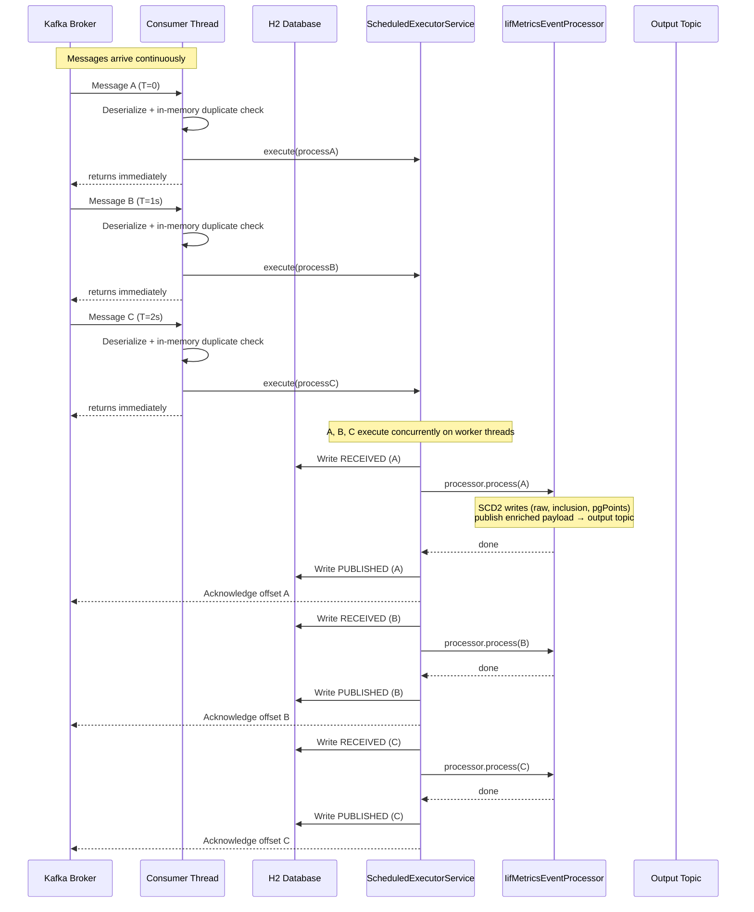

# Message Processing Concurrency Flow

Paste the diagram below into [mermaid.live](https://mermaid.live) to render it.

## Key Points

- The **consumer thread makes zero DB calls** — fast operations only (deserialize, in-memory duplicate check, execute), then returns immediately
- Messages are dispatched immediately to the `ScheduledExecutorService` worker pool — no artificial delay
- **All messages are in-flight simultaneously**, each executing on their own worker thread
- `processor.process()` handles all business logic in one `@Transactional` boundary: SCD2 writes across three tables (raw, inclusion, pgPoints) and the Kafka publish — all commit or all roll back together
- `Write PUBLISHED` and acknowledgment only happen after `processor.process()` returns successfully
- **Acknowledgment happens on the worker thread** after the full pipeline completes — Kafka does not advance the offset until then
- If the app restarts mid-flight, un-acked messages are redelivered; the unique constraint on `ReceivedRecord.message_id` detects the duplicate INSERT and routes to dead letter safely
- If the app restarts mid-flight, un-acked messages are redelivered; the unique constraint on `ReceivedRecord.message_id` detects the duplicate INSERT and routes to dead letter safely
